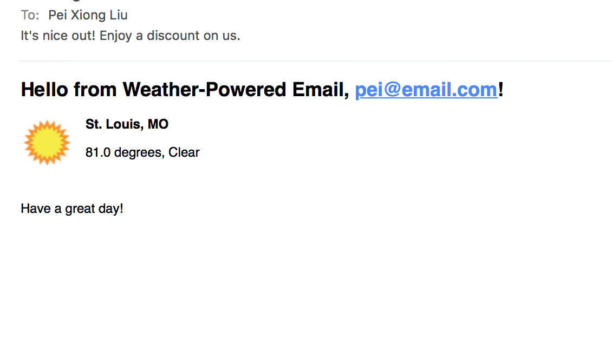

# About
Author: **Pei Xiong Liu**

This app allows users to subscribe to a mailing list with their email and location. A script can then be run to send out customized emails based on the current weather at the location (using the [Wunderground API](https://www.wunderground.com/weather/api/)).

## Features

- client-side and server-side validation for user inputs
- comprehensive error handling
- an in-house client for interfacing with the Wunderground API complete with caching to minimize the number of calls we have to make as well as test specs.

### Screenshots


<kbd>
  
</kbd>

# Setup
This project uses ruby-2.4.0

1. Bundle, create databases, and populate the `cities` table with the top 100 cities by population:

  ```
  > bundle install
  > rake db:create
  > rake db:migrate
  > rake db:import_cities_from_csv
  ```

2. Create/edit `config/settings.yml` and input your settings (Wunderground API key and credentials of gmail account emails will be sent from). See `config.settings-sample.yml` for reference.

3. Start server: `> rails s` then visit 'localhost:3000'.

4. Run tests: `> bundle exec rspec`


# Sending out emails
Run the following rake task to send out an email to each subscribed user. The subject line and content will differ depending on weather conditions at the user's location. Note that there is a deliberate delay between sending emails to keep from going over Wunderground's 5-calls-per-minute limit.

```
> rake mailer:send_weather_emails
```

